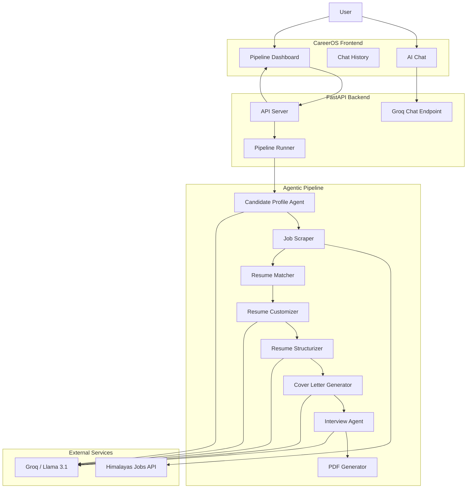

#  AI Agentic Job Application Pipeline

> An AI-powered career automation system that discovers job opportunities, evaluates resume–job compatibility, generates role-specific resumes, creates cover letters, prepares interview material, and produces polished PDF documents through an agentic workflow.

The **AI Agentic Job Application Pipeline** is an end-to-end career assistant built around a Python backend, LangGraph orchestration, Groq-powered LLM agents, and a React-based frontend.

Instead of treating a resume as a static document, the system takes a candidate's resume and turns it into a complete application-preparation workflow:

```text
Resume
   │
   ▼
Candidate Profile Extraction
   │
   ▼
Job Discovery
   │
   ▼
Resume ↔ Job Matching
   │
   ▼
Resume Tailoring
   │
   ▼
Structured Resume Generation
   │
   ├───────────────┐
   ▼               ▼
Cover Letter   Interview Preparation
   │               │
   └───────┬───────┘
           ▼
      PDF Generation
           │
           ▼
     Application Pack
```

The project also provides **CareerOS**, a web interface for interacting with the AI assistant, viewing conversation history, and running the complete resume optimization pipeline.

---

## ✨ Features

### 🔎 Automated Job Discovery

The pipeline retrieves job listings from the **Himalayas Jobs API** and extracts useful information including:

* Job title
* Company
* Application URL
* Tags
* Job description
* Category
* Scraping timestamp

The scraper currently requests up to 10 jobs by default.

---

### 🧠 Resume–Job Matching

The system compares the candidate's resume against discovered job descriptions using:

* TF-IDF vectorization
* Cosine similarity
* Job description + job tags

Each job receives a similarity score and the highest-scoring jobs are selected for further processing.

The matching stage is intentionally lightweight and does not require an embedding database or external vector service.

---

### 👤 Candidate Profile Extraction

The candidate's resume is analyzed by an LLM to extract a structured profile containing:

```json
{
  "name": "",
  "headline": "",
  "email": "",
  "phone": "",
  "linkedin": "",
  "location": ""
}
```

The extractor also contains regex-based fallback detection for:

* Email addresses
* Phone numbers
* LinkedIn URLs

Unknown values are left empty rather than being invented.

---

### 📄 AI Resume Tailoring

For each selected job, the LLM generates a role-specific version of the candidate's resume.

The resume customization prompt instructs the model to:

* Emphasize relevant skills and experience
* Optimize the resume for ATS-style screening
* Keep the document under two pages
* Maintain professional language
* Avoid fabricating candidate information

The current implementation uses **Llama 3.1 8B Instant through Groq**.

---

### 🧩 Structured Resume Generation

Generated resumes are converted into a predictable JSON structure containing:

* Professional summary
* Experience
* Projects
* Education
* Skills
* Certifications

For example:

```json
{
  "summary": "...",
  "experience": [
    {
      "title": "...",
      "company": "...",
      "location": "...",
      "start": "2025",
      "end": "Present",
      "bullets": [
        "...",
        "..."
      ]
    }
  ],
  "projects": [],
  "education": [],
  "skills": {
    "technical": [],
    "tools": [],
    "soft": []
  },
  "certifications": []
}
```

The structuring agent uses a strict schema and includes JSON recovery/normalization logic to make LLM output easier to consume downstream.

---

### ✉️ Tailored Cover Letters

For every selected position, the pipeline can generate a job-specific cover letter using:

* Job title
* Company
* Job description
* Tailored resume

The prompt targets concise, professional, ATS-friendly letters of approximately 180–300 words and explicitly instructs the model not to invent facts.

---

### 🎯 Interview Preparation

The pipeline also generates interview preparation material for each matched role.

The interview agent produces:

* 8 technical questions
* 4 HR questions
* 4 behavioral questions
* Key topics to revise
* A short mock-interview strategy

The generated preparation is based on both the job description and tailored resume.

---

### 🖨️ Professional PDF Generation

The project generates PDF documents using ReportLab.

Resume output currently supports two visual variants:

#### Classic

* Single-column layout
* ATS-friendly structure
* Minimal styling
* Professional typography

#### Teal

* Cover page
* Accent styling
* Skill chips
* Single-column resume layout

The PDF renderer can consume either the structured JSON representation or fall back to parsing unstructured resume text.

Cover letters and interview preparation documents can also be rendered as PDFs.

---

### 🖥️ CareerOS Frontend

The project includes a React/Vite frontend called **CareerOS**.

It provides three primary areas:

#### 💬 New Chat

A conversational interface for interacting with the career assistant.

#### 🕘 History

Previously created conversations are stored locally in the browser and can be:

* Searched
* Renamed
* Deleted
* Reopened

#### ⚙️ Pipeline

A visual interface for:

1. Uploading a resume
2. Starting the pipeline
3. Monitoring pipeline stages
4. Viewing job/match statistics

The frontend is built with React Router, Tailwind CSS, Lucide icons, React Markdown, and Shiki syntax highlighting.

---

# 🏗️ Architecture



---

# 🔄 Pipeline Workflow

The main agentic workflow is implemented using **LangGraph**.

The current graph follows this sequence:

```text
Extract Candidate Profile
          ↓
     Scrape Jobs
          ↓
    Match Resume
          ↓
     Tailor Resume
          ↓
  Structure Resume
          ↓
 Generate Cover Letters
          ↓
 Generate Interview Prep
          ↓
     Render PDFs
          ↓
         END
```

The graph is explicitly constructed with LangGraph `StateGraph`. Each stage receives and returns part of a shared `PipelineState`.

### Pipeline State

The state contains fields such as:

```python
class PipelineState(TypedDict, total=False):
    resume_text: str
    profile: Dict[str, Any]
    jobs: List[Dict[str, Any]]
    matches: List[Dict[str, Any]]
    tailored: List[Dict[str, Any]]
    structured: List[Dict[str, Any]]
    cover_letters: List[Dict[str, Any]]
    interview: List[Dict[str, Any]]
    error: Optional[str]
```

This allows the output of one stage to become the input of subsequent stages.

---

# 🧠 Why LangGraph?

LangGraph is used to model the workflow as an explicit stateful graph instead of placing the entire pipeline inside one large function.

This provides a foundation for future additions such as:

* Conditional routing
* Parallel agent execution
* Human approval steps
* Retry logic
* Additional career agents
* Job filtering nodes
* Company research
* Application tracking
* Interview feedback loops

The current implementation keeps the graph deterministic and sequential, which makes the workflow easier to reason about and debug.

---

# 🛠️ Tech Stack

## Backend

| Technology           | Purpose                        |
| -------------------- | ------------------------------ |
| Python               | Core application               |
| FastAPI              | REST API                       |
| LangGraph            | Agentic workflow orchestration |
| LangChain            | LLM integration                |
| Groq                 | LLM inference                  |
| Llama 3.1 8B Instant | Generation model               |
| scikit-learn         | TF-IDF + cosine similarity     |
| Requests             | Job API requests               |
| Pydantic             | API request models             |
| python-dotenv        | Environment configuration      |
| pypdf                | PDF resume text extraction     |
| ReportLab            | PDF generation                 |
| python-slugify       | Safe output filenames          |

## Frontend

| Technology     | Purpose                  |
| -------------- | ------------------------ |
| React 19       | UI                       |
| Vite           | Frontend tooling         |
| React Router   | Client-side routing      |
| Tailwind CSS   | Styling                  |
| Lucide React   | Icons                    |
| React Markdown | AI response rendering    |
| Shiki          | Code syntax highlighting |
| Radix UI       | UI primitives            |

The frontend dependency configuration is defined in `frontend/package.json`.

---

# 📁 Project Structure

```text
AI-Agentic-Job-Application-Pipeline/
│
├── agents/
│   ├── job_scraper.py
│   ├── resume_matcher.py
│   ├── resume_customizer.py
│   ├── resume_structurizer.py
│   ├── candidate_extractor.py
│   ├── coverletter_generator.py
│   ├── interview_agent.py
│   └── format_resume_pdf.py
│
├── api/
│   └── server.py
│
├── services/
│   └── pipeline_service.py
│
├── data/
│   ├── sample_resume.txt
│   ├── sample_jobs.json
│   └── generated JSON artifacts
│
├── outputs/
│   ├── resumes/
│   └── runs/
│
├── frontend/
│   ├── src/
│   │   ├── components/
│   │   ├── layout/
│   │   ├── pages/
│   │   │   ├── ChatHome.jsx
│   │   │   ├── ChatPage.jsx
│   │   │   ├── HistoryPage.jsx
│   │   │   └── PipelinePage.jsx
│   │   └── ...
│   ├── package.json
│   └── vite.config.js
│
├── main.py
├── requirements.txt
├── .gitignore
└── README.md
```

---

# ⚙️ Installation

## Prerequisites

Make sure you have:

* Python 3.10+
* Node.js 18+
* npm
* A Groq API key

---

## 1. Clone the repository

```bash
git clone https://github.com/faizaan35/AI-Agentic-Job-Application-Pipeline.git

cd AI-Agentic-Job-Application-Pipeline
```

---

## 2. Create a Python virtual environment

### Windows

```powershell
python -m venv .venv

.venv\Scripts\activate
```

### macOS / Linux

```bash
python3 -m venv .venv

source .venv/bin/activate
```

---

## 3. Install Python dependencies

```bash
pip install fastapi uvicorn requests pydantic python-dotenv
pip install langchain langchain-groq langgraph
pip install scikit-learn pypdf reportlab python-slugify
```

> **Note:** The repository currently contains an empty `requirements.txt`, so the dependencies above reflect the libraries imported by the current implementation rather than relying on the existing file.

A populated `requirements.txt` can therefore be created with:

```text
fastapi
uvicorn
requests
pydantic
python-dotenv
langchain
langchain-groq
langgraph
scikit-learn
pypdf
reportlab
python-slugify
```

---

# 🔐 Environment Variables

Create a `.env` file in the project root:

```env
GROQ_API_KEY=your_groq_api_key_here
```

The project loads the API key using `python-dotenv`.

The LLM-powered agents use the Groq API with:

```text
Model: llama-3.1-8b-instant
```

The same model is also used by the CareerOS chat endpoint.

---

# 🚀 Running the Backend

Start the FastAPI server from the repository root:

```bash
uvicorn api.server:app --reload --port 8000
```

The API will be available at:

```text
http://127.0.0.1:8000
```

FastAPI automatically provides interactive API documentation at:

```text
http://127.0.0.1:8000/docs
```

---

# 🧪 API Endpoints

## Health Check

```http
GET /health
```

Response:

```json
{
  "ok": true
}
```

---

## Start Pipeline

```http
POST /run
```

The endpoint accepts either:

* `resume_text`
* A PDF file
* A TXT file

Optional parameters:

```text
top_n
agentic
```

Example:

```bash
curl -X POST http://127.0.0.1:8000/run \
  -F "file=@resume.pdf" \
  -F "top_n=2" \
  -F "agentic=true"
```

The endpoint returns a job identifier:

```json
{
  "job_id": "abc123...",
  "status": "started"
}
```

PDF resumes are processed using `pypdf`, while TXT uploads are decoded directly. Unsupported formats are rejected.

---

## Check Job Status

```http
GET /jobs/{job_id}
```

Example:

```bash
curl http://127.0.0.1:8000/jobs/<JOB_ID>
```

A completed job returns the generated pipeline result.

---

## Download Generated Files

```http
GET /download?path=<output-file>
```

The endpoint only serves files located under the `outputs` directory.

---

## List Pipeline Runs

```http
GET /runs
```

Returns available pipeline run directories under:

```text
outputs/runs/
```

---

## AI Chat

```http
POST /chat
```

Request:

```json
{
  "messages": [
    {
      "role": "user",
      "content": "How should I prepare for a backend developer interview?"
    }
  ]
}
```

The endpoint forwards the conversation to Groq and returns:

```json
{
  "reply": "..."
}
```

The CareerOS frontend communicates with this endpoint at:

```text
http://127.0.0.1:8000/chat
```

---

# 🖥️ Running CareerOS

Open another terminal:

```bash
cd frontend
```

Install dependencies:

```bash
npm install
```

Start the development server:

```bash
npm run dev
```

Vite will provide the frontend development URL, typically:

```text
http://localhost:5173
```

---

# 🧭 CareerOS Navigation

The frontend contains three primary routes:

```text
/
├── New Chat
│
├── /chat/:id
│   └── AI Career Assistant
│
├── /history
│   └── Conversation History
│
└── /pipeline
    └── Resume Optimization Pipeline
```

These routes are defined in `App.jsx`.

---

# 💬 AI Career Assistant

The chat interface provides a conversational interface to the Groq-powered career assistant.

Features include:

* Multi-message conversations
* Markdown rendering
* Code block rendering
* Syntax highlighting
* Copy-to-clipboard
* Typing indicator
* Persistent local chat history
* Automatic scrolling

Chat conversations are stored in the browser's `localStorage`, meaning the current implementation does not require a database for chat history.

---

# 📊 Pipeline Dashboard

The Pipeline page provides a visual representation of the workflow:

```text
┌──────────────┐
│ Scrape Jobs  │
└──────┬───────┘
       ↓
┌───────────────┐
│ Match Resume  │
└──────┬────────┘
       ↓
┌───────────────┐
│ Tailor Resume │
└──────┬────────┘
       ↓
┌──────────────────────┐
│ Interview Preparation│
└──────────┬───────────┘
           ↓
┌────────────────┐
│ Render PDFs    │
└────────────────┘
```

The interface displays:

* Jobs scraped
* Top matches
* Generated documents
* Current pipeline stage
* Processing status

The frontend sends the uploaded resume to `/run` and polls `/jobs/{job_id}` for the result.

---

# 📦 Generated Outputs

Pipeline execution produces several types of artifacts.

## Candidate Profile

```text
data/candidate_profile.json
```

Example:

```json
{
  "name": "Candidate Name",
  "headline": "Software Engineer",
  "email": "candidate@example.com",
  "phone": "+91...",
  "linkedin": "linkedin.com/in/example",
  "location": "India"
}
```

---

## Matched Jobs

The scraper stores discovered jobs in:

```text
data/sample_jobs.json
```

Each job contains fields such as:

```json
{
  "title": "...",
  "company": "...",
  "link": "...",
  "tags": [],
  "description": "...",
  "category": "...",
  "scraped_at": "..."
}
```

---

## Tailored Resumes

The pipeline can produce:

```text
data/top_matched_resumes.json
```

and structured versions:

```text
data/top_matched_resumes_structured.json
```

---

## Cover Letters

Generated cover-letter information is stored alongside the relevant application data.

---

## Interview Preparation

Interview preparation contains:

* Technical questions
* HR questions
* Behavioral questions
* Revision topics
* Mock interview strategy

---

## PDF Documents

Generated PDFs are written under:

```text
outputs/resumes/
```

and other generated run artifacts are stored under:

```text
outputs/runs/
```

---

# 🔐 Privacy & Security

This project processes potentially sensitive career information including:

* Resumes
* Contact information
* Phone numbers
* Email addresses
* LinkedIn profiles
* Employment history

### Important recommendations

Do not commit:

```text
.env
```

or private candidate documents to Git.

The repository's `.gitignore` already excludes:

```text
.env
node_modules
dist
build
```

For a production deployment, additional protections should be added around:

* Uploaded resumes
* Generated PDFs
* Candidate profiles
* API authentication
* CORS configuration
* File download authorization
* Persistent job state

---

# ⚠️ Current Limitations

This project is currently designed primarily as an **AI-assisted job application preparation system**, not a fully autonomous application-submission bot.

### Current limitations include:

* Job discovery currently uses the Himalayas Jobs API.
* Resume matching is based on TF-IDF/cosine similarity rather than semantic embeddings.
* The current LangGraph pipeline executes stages sequentially.
* The agentic graph currently selects two matched jobs.
* Job execution state is maintained in process memory.
* Chat history is stored in browser `localStorage`.
* There is no persistent database for pipeline jobs.
* There is no authentication system.
* There is no automatic application submission.
* Generated AI content should be reviewed before being used in an actual application.
* The current frontend is configured to communicate with a local backend at `127.0.0.1:8000`.

The API also currently enables permissive CORS (`allow_origins=["*"]`), which should be tightened before production deployment.

---

# 🧪 Example End-to-End Workflow

Suppose a candidate uploads:

```text
resume.pdf
```

The system performs:

### 1. Extract

```text
resume.pdf
      ↓
Candidate Profile
```

### 2. Discover

```text
Himalayas API
      ↓
10 Job Listings
```

### 3. Match

```text
Resume
   +
Job Descriptions
   ↓
TF-IDF
   ↓
Cosine Similarity
   ↓
Top Matches
```

### 4. Tailor

```text
Resume + Job Description
          ↓
      Groq / Llama
          ↓
  Tailored Resume
```

### 5. Structure

```text
Tailored Resume
       ↓
Structured JSON
```

### 6. Generate Application Material

```text
                 ┌── Cover Letter
Tailored Resume ─┼── Interview Prep
                 └── Resume PDF
```

### 7. Final Output

```text
Application Pack
│
├── Tailored Resume
├── Cover Letter
├── Interview Preparation
└── PDF Documents
```

---

# 🧑‍💻 Running the Standalone Pipeline

The repository also contains `main.py`, which runs the original pipeline directly using the sample resume.

Run:

```bash
python main.py
```

The script:

1. Loads the sample resume
2. Extracts a candidate profile
3. Scrapes jobs
4. Matches the resume against jobs
5. Selects the top jobs
6. Generates tailored resumes
7. Structures the resumes
8. Generates PDFs
9. Generates cover letters

The standalone entry point uses the modules under `agents/` directly.

---

# 🧱 Design Philosophy

The project separates the workflow into specialized components rather than placing every operation into a single AI prompt.

```text
                    ┌───────────────────┐
                    │ Candidate Profile │
                    └─────────┬─────────┘
                              │
                              ▼
┌──────────────┐      ┌──────────────┐
│ Job Scraper  │ ───► │ Resume Match │
└──────────────┘      └───────┬──────┘
                              │
                              ▼
                       ┌─────────────┐
                       │ Resume AI   │
                       └──────┬──────┘
                              │
                    ┌─────────┴─────────┐
                    ▼                   ▼
             ┌────────────┐      ┌──────────────┐
             │ Cover      │      │ Interview    │
             │ Letter AI  │      │ Coach AI     │
             └─────┬──────┘      └──────┬───────┘
                   │                    │
                   └─────────┬──────────┘
                             ▼
                      ┌────────────┐
                      │ PDF Engine │
                      └────────────┘
```

This separation makes it possible to independently replace or improve individual stages without rewriting the entire system.

---

# 🔮 Future Improvements

Potential extensions include:

### Job Discovery

* LinkedIn-compatible public job sources
* Greenhouse
* Lever
* Wellfound
* YC jobs
* Company career pages
* Job deduplication
* Location filtering
* Salary filtering

### Resume Matching

* Sentence-transformer embeddings
* Vector database
* Skill ontology
* Experience weighting
* Education weighting
* Location compatibility
* Seniority detection
* Explainable match reports

### Agentic Workflow

* Parallel agent execution
* Conditional routing
* Retry nodes
* Human approval nodes
* Agent memory
* Tool calling
* Job research agent
* Company research agent
* Application strategy agent

### Application Preparation

* ATS compatibility analysis
* Resume quality scoring
* Job-specific skill-gap analysis
* Recruiter outreach generation
* LinkedIn message generation
* Application question generation
* STAR story generation

### Infrastructure

* PostgreSQL
* Redis
* Background workers
* Persistent pipeline state
* Authentication
* User accounts
* Cloud file storage
* Production deployment

### Frontend

* Application tracker
* Job comparison dashboard
* Resume version management
* Generated-document preview
* Agent activity timeline
* Match explanation UI
* Interview simulator
* Analytics dashboard

---

# 🗺️ Roadmap

```text
[x] Job discovery
[x] Resume matching
[x] Candidate profile extraction
[x] AI resume tailoring
[x] Structured resume generation
[x] Cover letter generation
[x] Interview preparation
[x] PDF generation
[x] LangGraph pipeline
[x] FastAPI backend
[x] CareerOS frontend
[x] Chat history
[x] Pipeline dashboard

[ ] Persistent database
[ ] User authentication
[ ] Semantic resume matching
[ ] More job sources
[ ] Company research agent
[ ] ATS analysis
[ ] Application tracker
[ ] Human approval nodes
[ ] Parallel agent execution
[ ] Production deployment
```

---


# 📜 License

This project currently does not specify a license in the repository.

If you intend to make the project open-source, add an appropriate `LICENSE` file and update this section accordingly.

---

# 👨‍💻 Author

**Mohd Faizaan**

GitHub:

https://github.com/faizaan35

Repository:

https://github.com/faizaan35/AI-Agentic-Job-Application-Pipeline

---

# ⭐ Project Summary

**AI Agentic Job Application Pipeline** transforms a candidate's resume into a complete, role-specific application preparation workflow.

Instead of manually repeating:

```text
Find Job
   ↓
Read JD
   ↓
Compare Resume
   ↓
Rewrite Resume
   ↓
Write Cover Letter
   ↓
Prepare for Interview
   ↓
Format Documents
```

the system coordinates these steps through an AI-powered pipeline:

```text
                    AI AGENTIC
                 CAREER PIPELINE
                       │
        ┌──────────────┼──────────────┐
        ▼              ▼              ▼
   Job Discovery   Resume Match   Candidate
                                  Profile
        │              │              │
        └──────────────┼──────────────┘
                       ▼
                 Resume Tailoring
                       │
             ┌─────────┴─────────┐
             ▼                   ▼
       Cover Letter        Interview Prep
             │                   │
             └─────────┬─────────┘
                       ▼
                 PDF Generation
                       │
                       ▼
                APPLICATION PACK
```

The result is a reusable AI-assisted career workflow that combines **job discovery, machine-learning-based matching, LLM generation, agentic orchestration, document generation, and a modern web interface** in a single project.
